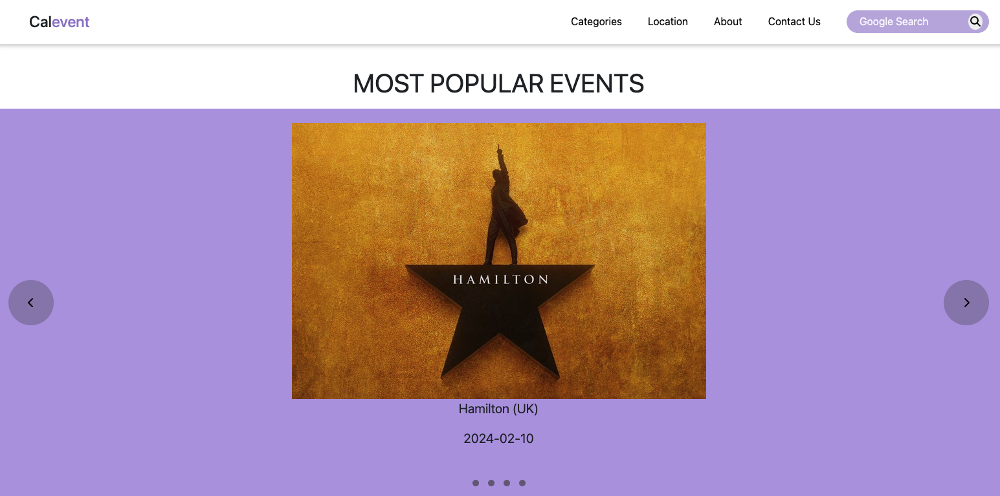

# CalEvent

An app to search event types based on user input. Including a suggested events feature, google search feature and extra joke generator for fun.

## USER STORY
As a user interested in discovering and attending events, I want to use an intuitive and multi-feature event search application to find events based on my preferences and inputs.

## ACCEPTANCE CRITERIA

Hero Section with Suggested Events:
    When I visit the app's homepage, I should see a visually appealing hero section.
    The hero section should be pre-populated with suggested events that catch my attention.

Advanced Search Form:
    I want to find events based on my inputs to multiple parameters, the app should provide an advanced search form.
    The form should include input fields for event type, date and location.
    It should be user-friendly and responsive, adapting to different screen sizes.

Dynamic Results Table:
    After submitting my search criteria, I expect to see a dynamic results table.
    The table should be generated using jQuery and display relevant details such as event name, date, location, and a price (if available).
    The table should update in real-time as I modify the search criteria without requiring a page refresh.

Integration with Google Search:
    The NavBar should include a button which searches for Google results.

Fun Extra: Joke Generator:
    As an added feature, I want to have a random joke generator for a lighthearted experience.
    The joke should be prominently displayed, and clicking a button should generate a new joke.
    Technological Stack:

The app should utilize JavaScript, HTML, CSS, Bootstrap, and jQuery.

It should integrate with relevant server APIs to fetch event data.

Cross-Browser Compatibility:
    The app should work consistently across major web browsers, including Chrome, Firefox, Safari, and Edge.

Responsive Design:
    The application should be responsive, providing a seamless experience on both desktop and mobile devices.

CONTRIBUTORS:,

Abdalla Diaai Mohamed,

Ami Edwards,

Joel Gogo,

Kwok Law,

Taha Hadj Lakehal

DEPLOYED URL - https://abdalla-diaai.github.io/calevent/

Webpage view

